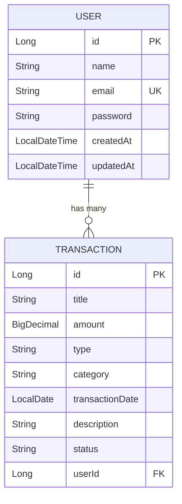

<div align="center">

# 💸 ExpenseTracker Pro

### *Next-Generation Financial Intelligence Platform*

[](https://openjdk.org/)
[](https://spring.io/projects/spring-boot)
[](https://react.dev/)
[](https://www.mysql.com/)
[](https://vite.dev/)
[](LICENSE)

[](https://spring.io/projects/spring-security)
[](https://www.framer.com/motion/)
[](https://d3js.org/)
[](https://www.docker.com/)
[](https://tailwindcss.com/)

---

*A production-grade, full-stack expense tracking application featuring a cinematic Anti-Gravity UI engine, enterprise-level JWT security, automated email reporting, and interactive D3.js physics-based data visualizations.*

[Features](#-features) •
[Tech Stack](#%EF%B8%8F-tech-stack) •
[Architecture](#-architecture) •
[Getting Started](#-getting-started) •
[Deployment](#-deployment) •
[API Docs](#-api-documentation) •
[Contributing](#-contributing)

</div>

---

## ✨ Features

### 🎨 Frontend — Cinematic UI/UX
- **Anti-Gravity Splash Screen** — 3D physics-based loading animation with particle effects
- **Aurora Glassmorphism Design** — Premium frosted-glass UI with dynamic mesh-gradient backgrounds
- **3D Tilt Cards** — Mouse-tracking perspective transforms using Framer Motion springs
- **Interactive D3.js Bubble Chart** — Drag-and-drop physics simulation where category bubbles bounce and collide
- **AI Intelligence Hub** — Custom dashboard offering smart financial insights, budget recommendations, and predictive visualizations
- **Admin Control Panel** — Full platform monitoring dashboard with system health metrics, security audits, and user management
- **Receipt OCR Scanner** — Interactive OCR interface to upload and automatically parse receipt details into transactions
- **Animated Counters** — Smooth number transitions for financial statistics
- **Responsive Layout** — Fully adaptive from desktop to mobile

### 🔐 Backend — Enterprise Architecture
- **Stateless JWT Authentication** — Secure token-based auth with BCrypt hashing and Refresh Token rotation
- **Spring Boot Caching Layer** — `@Cacheable` on analytics queries with automatic `@CacheEvict` on mutations
- **Automated Email System** — Styled HTML welcome, password reset, and monthly summary emails sent asynchronously
- **Scheduled Cron Jobs** — Automated scheduler processing recurring transactions and monthly reports
- **RESTful API Design** — Clean controller-service-repository architecture with DTO and mapper patterns
- **Swagger/OpenAPI Docs** — Auto-generated interactive API documentation

### 📊 Analytics & Reporting
- **Real-time Dashboard** — Income, expense, balance, and savings rate at a glance
- **Monthly Income vs Expense Reports** — Trend analysis with line charts
- **Category Breakdown** — Pie charts and percentage-bar tables
- **PDF Export** — One-click professional PDF generation with `jsPDF` + `autoTable`

### 🛡️ Security & Integrity
- **BCrypt Password Hashing** — Military-grade encryption for all user passwords
- **Refresh Token Rotation** — Protection against replay attacks and stale logins
- **API Rate Limiting** — Bucket4j-based request rate limiting per user/IP
- **Request Sanitization Filter** — Automatic prevention of XSS and SQL injection payloads
- **Audit Logging** — Secure logs tracking administrative and security-critical actions
- **Data Ownership Enforcement** — Strictly scoped user databases ensuring isolation

---

## 🛠️ Tech Stack

### Frontend
| Technology | Purpose |
|---|---|
| **React 19** | UI component framework |
| **Vite 8** | Lightning-fast build tooling |
| **Framer Motion 12** | 3D animations, spring physics, gesture handling |
| **D3.js 7** | Interactive force-simulation bubble chart |
| **Recharts** | Line charts, pie charts, bar charts |
| **Axios** | HTTP client with JWT interceptors |
| **React Router v7** | Client-side routing with protected layouts |
| **TailwindCSS 4** | Utility-first CSS framework |
| **jsPDF** | Client-side PDF generation |
| **React Icons** | Icon library (FontAwesome, etc.) |

### Backend
| Technology | Purpose |
|---|---|
| **Java 17** | Core language |
| **Spring Boot 4** | Application framework |
| **Spring Security** | JWT authentication & authorization |
| **Spring Data JPA** | ORM with Hibernate |
| **Spring Cache** | In-memory caching layer |
| **Spring Mail** | Async email dispatch via Gmail SMTP |
| **Spring Scheduler** | Cron-based automated monthly reports |
| **MySQL 8** | Relational database |
| **Lombok** | Boilerplate reduction |
| **SpringDoc OpenAPI** | Swagger UI auto-generation |

### DevOps & Deployment
| Technology | Purpose |
|---|---|
| **Docker** | Multi-stage containerized backend |
| **Vercel** | Frontend hosting & CDN |
| **Render** | Backend hosting (Docker) |
| **Railway** | Managed MySQL database |

---

## 🏗 Architecture

```
expense-tracker-pro/
├── backend/                          # Spring Boot Application
│   ├── Dockerfile                    # Multi-stage production build
│   ├── pom.xml                       # Maven dependencies
│   └── src/main/java/com/expensetracker/
│       ├── config/                   # CORS, Cache configuration
│       ├── controller/               # REST API endpoints
│       ├── dto/                      # Request/Response DTOs
│       │   ├── request/              # Incoming payloads
│       │   └── response/             # Outgoing payloads
│       ├── entity/                   # JPA entities (User, Transaction)
│       ├── repository/               # Spring Data JPA repositories
│       ├── security/                 # JWT filter, config, entry point
│       ├── service/                  # Business logic interfaces
│       │   └── impl/                 # Service implementations
│       └── ExpenseTrackerApplication.java
│
├── frontend/                         # React + Vite Application
│   ├── public/                       # Static assets
│   └── src/
│       ├── components/               # Reusable UI components
│       │   ├── Charts/               # PieChart, LineChart, BubbleChart
│       │   ├── Footer/               # Global glassmorphism footer
│       │   ├── Navbar/               # Top navigation bar
│       │   ├── Neon/                 # Aurora background effects
│       │   ├── Sidebar/              # Navigation sidebar
│       │   └── SplashScreen/         # 3D Anti-Gravity splash
│       ├── context/                  # React Context (Auth, Theme)
│       ├── hooks/                    # Custom hooks (useAuth, useTheme)
│       ├── pages/                    # Route-level page components
│       │   ├── Dashboard/            # Main analytics dashboard
│       │   ├── Transactions/         # CRUD transaction management
│       │   ├── Reports/              # Summary & Monthly reports
│       │   ├── Profile/              # User profile management
│       │   └── Settings/             # Account security settings
│       ├── services/                 # API service layer (Axios)
│       ├── styles/                   # Global CSS, variables, themes
│       └── utils/                    # Helpers (currency, validation)
│
└── database/                         # SQL schema & seed scripts
```

---

## 🚀 Getting Started

### Prerequisites

- **Java 17+** — [Download](https://adoptium.net/)
- **Maven 3.9+** — [Download](https://maven.apache.org/)
- **Node.js 20+** — [Download](https://nodejs.org/)
- **MySQL 8+** — [Download](https://dev.mysql.com/downloads/)

### 1. Clone the Repository

```bash
git clone https://github.com/Ganesh40292/expense-tracker-pro.git
cd expense-tracker-pro
```

### 2. Database Setup

Create the MySQL database:

```sql
CREATE DATABASE expense_tracker;
```

### 3. Backend Setup

```bash
cd backend
```

Create a `.env` file in the `backend/` directory:

```env
DB_URL=jdbc:mysql://localhost:3306/expense_tracker
DB_USERNAME=root
DB_PASSWORD=your-mysql-password
MAIL_USERNAME=your-email@gmail.com
MAIL_PASSWORD=your-gmail-app-password
```

> 💡 **Gmail App Password:** Go to Google Account → Security → 2-Step Verification → App Passwords

Start the backend:

```bash
mvn spring-boot:run
```

The API will be available at `http://localhost:8080/api`

### 4. Frontend Setup

```bash
cd frontend
npm install
npm run dev
```

The app will be available at `http://localhost:5173`

---

## ☁️ Deployment

This project is pre-configured for a **3-tier cloud deployment**:

| Service | Platform | Configuration |
|---|---|---|
| **Database** | Railway | Managed MySQL instance |
| **Backend** | Render | Docker-based web service |
| **Frontend** | Vercel | Static site with Vite |

### Environment Variables

#### Render (Backend)
| Variable | Description |
|---|---|
| `DB_URL` | Railway MySQL JDBC URL |
| `DB_USERNAME` | Railway MySQL username |
| `DB_PASSWORD` | Railway MySQL password |
| `JWT_SECRET` | Random 64-character secret key |
| `MAIL_USERNAME` | Gmail address for sending emails |
| `MAIL_PASSWORD` | Gmail App Password (16 chars) |
| `FRONTEND_URL` | Vercel deployment URL |
| `SHOW_SQL` | Set to `false` for production |

#### Vercel (Frontend)
| Variable | Description |
|---|---|
| `VITE_API_URL` | Render backend URL + `/api` |

> 📖 For detailed step-by-step deployment instructions, see the [Deployment Guide](docs/DEPLOYMENT.md).

---

## 📡 API Documentation

Once the backend is running, interactive Swagger documentation is available at:

```
http://localhost:8080/swagger-ui/index.html
```

### Key Endpoints

#### Authentication
| Method | Endpoint | Description |
|---|---|---|
| `POST` | `/api/auth/register` | Register a new user |
| `POST` | `/api/auth/login` | Login & receive JWT token |
| `PUT` | `/api/auth/password` | Update password |

#### Transactions
| Method | Endpoint | Description |
|---|---|---|
| `GET` | `/api/transactions` | Get all user transactions |
| `POST` | `/api/transactions` | Create a new transaction |
| `PUT` | `/api/transactions/{id}` | Update a transaction |
| `DELETE` | `/api/transactions/{id}` | Delete a transaction |

#### Dashboard & Reports
| Method | Endpoint | Description |
|---|---|---|
| `GET` | `/api/dashboard/{userId}` | Get dashboard analytics |
| `GET` | `/api/reports/monthly/{userId}` | Monthly income vs expense |
| `GET` | `/api/reports/expense-summary/{userId}` | Category breakdown |

---

## 📧 Email System

The application sends beautifully designed HTML emails:

| Email Type | Trigger | Template |
|---|---|---|
| **Welcome Email** | User registration | Glassmorphism dark-mode template with CTA button |
| **Monthly Report** | 1st of every month (10:00 AM) | Income/expense summary with "View Report" link |

Emails are sent asynchronously using `@Async` to prevent blocking the main thread.

---

## 📈 Performance Optimizations

| Optimization | Impact |
|---|---|
| **Spring Cache** | Dashboard queries return in ~5ms (vs ~100ms uncached) |
| **Async Email** | Registration response is instant; email sends in background |
| **Vite HMR** | Frontend hot-reloads in <50ms during development |
| **Docker Multi-stage** | Production image is ~200MB (JRE Alpine base) |
| **JWT Stateless** | Zero server-side session storage; horizontally scalable |

---

## 🤝 Contributing

Contributions are welcome! Please follow these steps:

1. Fork the repository
2. Create a feature branch (`git checkout -b feature/amazing-feature`)
3. Commit your changes (`git commit -m 'Add amazing feature'`)
4. Push to the branch (`git push origin feature/amazing-feature`)
5. Open a Pull Request

---

## 📝 License

This project is licensed under the **MIT License** — see the [LICENSE](LICENSE) file for details.

---

## 🗄️ Database Schema

### Entity Relationship Diagram



### Users Table

| Column | Type | Constraints |
|---|---|---|
| `id` | `BIGINT` | Primary Key, Auto Increment |
| `name` | `VARCHAR(100)` | Not Null |
| `email` | `VARCHAR(150)` | Not Null, Unique |
| `password` | `VARCHAR(255)` | Not Null (BCrypt hashed) |
| `created_at` | `DATETIME` | Auto-generated |
| `updated_at` | `DATETIME` | Auto-updated |

### Transactions Table

| Column | Type | Constraints |
|---|---|---|
| `id` | `BIGINT` | Primary Key, Auto Increment |
| `title` | `VARCHAR(100)` | Not Null |
| `amount` | `DECIMAL(12,2)` | Not Null |
| `type` | `VARCHAR(20)` | `INCOME` or `EXPENSE` |
| `category` | `VARCHAR(50)` | e.g., Food, Travel, Shopping |
| `transaction_date` | `DATE` | Not Null |
| `description` | `TEXT` | Optional |
| `status` | `VARCHAR(20)` | `COMPLETED`, `PENDING` |
| `user_id` | `BIGINT` | Foreign Key → `users.id` |

---

## 📸 Screenshots

> 🖼️ *Screenshots coming soon — deploy the app and see the magic yourself!*

| Page | Description |
|---|---|
| **Splash Screen** | 3D Anti-Gravity particle animation with physics engine |
| **Login / Register** | Aurora glassmorphism authentication forms |
| **Dashboard** | Real-time financial analytics with animated stat cards |
| **D3 Bubble Chart** | Interactive physics-based category visualization |
| **Transactions** | Full CRUD table with search, sort, and status badges |
| **Reports** | Monthly breakdown with percentage bars and PDF export |
| **Profile** | User management with password update capability |
| **Welcome Email** | Dark-mode HTML email with gradient CTA button |

---

## 🔧 Troubleshooting

### Common Issues

<details>
<summary><b>❌ Port 8080 already in use</b></summary>

```bash
# Windows — Find and kill the process
netstat -ano | findstr :8080
taskkill /PID <PID_NUMBER> /F
```

</details>

<details>
<summary><b>❌ CORS errors in browser console</b></summary>

Ensure `FRONTEND_URL` environment variable matches your frontend domain exactly (no trailing slash).

```properties
# ✅ Correct
FRONTEND_URL=https://expense-tracker-pro.vercel.app

# ❌ Wrong
FRONTEND_URL=https://expense-tracker-pro.vercel.app/
```

</details>

<details>
<summary><b>❌ Email not sending / Authentication failed</b></summary>

1. Ensure 2-Step Verification is enabled on the Gmail account
2. Generate a new App Password (Google Account → Security → App Passwords)
3. Verify the password is exactly 16 characters with no spaces
4. Check `MAIL_USERNAME` and `MAIL_PASSWORD` environment variables are set correctly

</details>

<details>
<summary><b>❌ CacheManager bean not found</b></summary>

Ensure `spring-boot-starter-cache` is in your `pom.xml`:

```xml
<dependency>
    <groupId>org.springframework.boot</groupId>
    <artifactId>spring-boot-starter-cache</artifactId>
</dependency>
```

</details>

<details>
<summary><b>❌ Render deploy fails — Dockerfile not found</b></summary>

Set the **Root Directory** to `backend` in your Render Web Service settings, not the repository root.

</details>

<details>
<summary><b>❌ Frontend shows blank page after Vercel deploy</b></summary>

Add a `vercel.json` in the `frontend/` directory:

```json
{
  "rewrites": [{ "source": "/(.*)", "destination": "/index.html" }]
}
```

This ensures React Router handles client-side routing correctly.

</details>

---

## 🗺️ Roadmap

### Completed ✅
- [x] JWT Authentication with Spring Security
- [x] Full Transaction CRUD with validation
- [x] Interactive Dashboard with animated statistics
- [x] D3.js Physics-based Bubble Chart
- [x] Aurora Glassmorphism UI with Framer Motion
- [x] Anti-Gravity 3D Splash Screen
- [x] PDF Export for reports
- [x] Automated monthly email reports via Cron Jobs
- [x] Spring Cache for high-performance analytics
- [x] Docker containerization
- [x] Cloud deployment configuration (Vercel + Render + Railway)
- [x] Dark/Light mode theme toggle
- [x] AI-powered spending insights and predictions
- [x] Budget goal tracking with progress indicators
- [x] Multi-currency support with live exchange rates

### Planned 🚧
- [ ] OAuth2 — "Login with Google" integration
- [ ] WebSocket real-time dashboard updates
- [ ] `Ctrl+K` command palette for power users
- [ ] CSV/Excel import for bulk transactions
- [ ] Push notifications for budget alerts
- [ ] Mobile-responsive PWA (Progressive Web App)

---

## 🙏 Acknowledgments

- [Spring Boot](https://spring.io/projects/spring-boot) — Enterprise-grade Java framework
- [React](https://react.dev/) — Component-based UI library
- [Framer Motion](https://www.framer.com/motion/) — Production-ready animation library
- [D3.js](https://d3js.org/) — Data-Driven Documents for advanced visualizations
- [Recharts](https://recharts.org/) — Composable chart components for React
- [Vite](https://vite.dev/) — Next-generation frontend build tool
- [TailwindCSS](https://tailwindcss.com/) — Utility-first CSS framework
- [jsPDF](https://github.com/parallax/jsPDF) — Client-side PDF generation
- [React Icons](https://react-icons.github.io/react-icons/) — Popular icon packs as React components

---

## 📊 Project Stats

```
Frontend:  ~55 components, ~26 pages, ~20 custom CSS files
Backend:   ~50 Java classes, ~16 REST endpoints, ~4 scheduled services
Database:  9 core entities with relational mapping
Emails:    3 custom HTML templates (Welcome + Monthly Report + Password Reset)
```

---

## 👨‍💻 Author

**Ganesh Prasad**

[](https://github.com/Ganesh40292)
[](https://www.linkedin.com/in/ganeshprasad40292)
[](mailto:expensetracker40292@gmail.com)

---

<div align="center">

**⭐ If you found this project useful, please give it a star!**

*Built with ❤️ using Spring Boot & React*

Made by **Ganesh Prasad** | © 2026 All Rights Reserved

</div>
