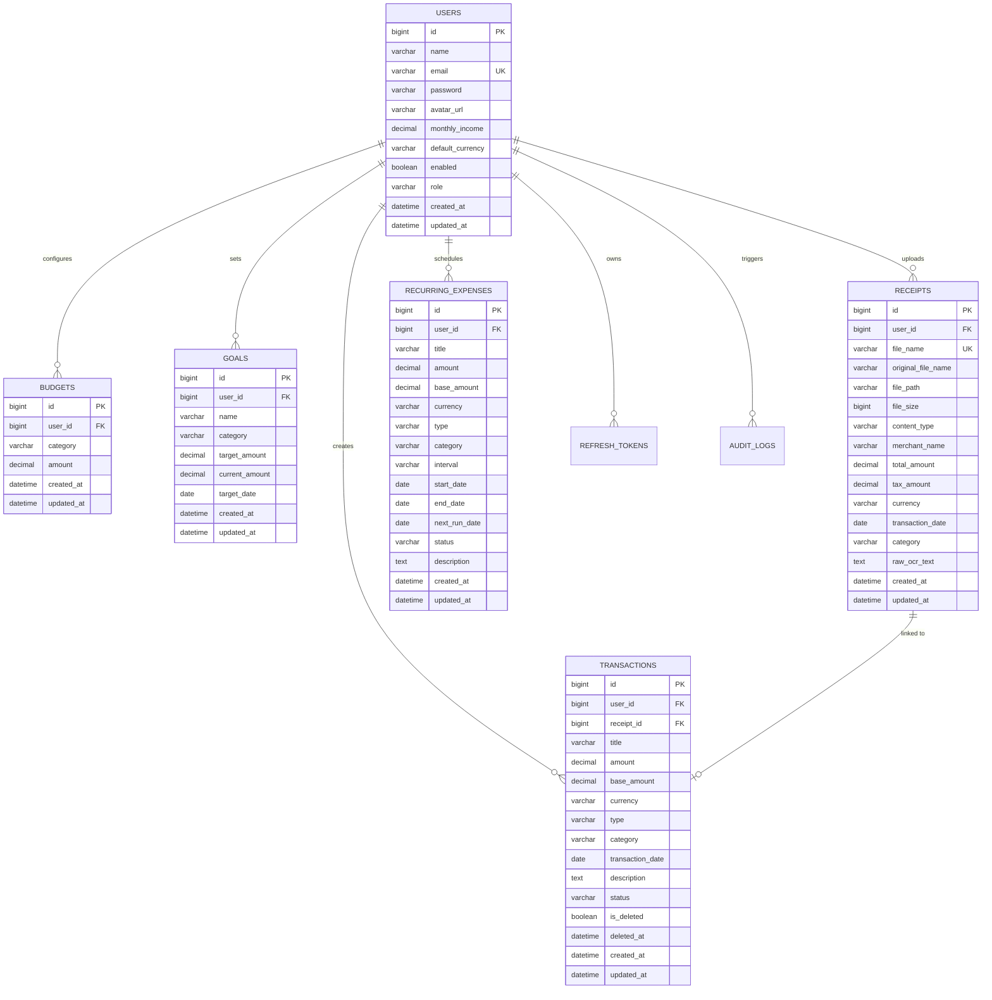

<div align="center">

# 💸 ExpenseTracker Pro — Enterprise AI Financial Intelligence Platform

### *Next-Generation Full-Stack Personal Finance & AI Advisory Ecosystem*

[](https://openjdk.org/)
[](https://spring.io/projects/spring-boot)
[](https://spring.io/projects/spring-security)
[](https://react.dev/)
[](https://aistudio.google.com/)
[](https://www.mysql.com/)
[](https://vite.dev/)
[](https://tailwindcss.com/)
[](https://www.framer.com/motion/)
[](LICENSE)

---

*ExpenseTracker Pro is a production-ready, full-stack financial ecosystem. It integrates Google Gemini 2.0 Multimodal Vision & LLM AI, a cinematic Aurora Glassmorphism UI, stateless JWT security with Refresh Token rotation, soft-delete recovery, multi-currency formatting, and physics-based data visualizations.*

</div>

---

## 📋 Table of Contents

- [1. Executive Summary \& Product Vision](#1-executive-summary--product-vision)
- [2. Architectural Overview](#2-architectural-overview)
- [3. Deep-Dive Feature Breakdown](#3-deep-dive-feature-breakdown)
  - [🤖 AI \& Machine Learning Engine](#-ai--machine-learning-engine)
  - [📊 Analytics, Visualizations \& Reporting](#-analytics-visualizations--reporting)
  - [🔐 Security, Authentication \& Data Integrity](#-security-authentication--data-integrity)
  - [🎨 Frontend User Experience \& Utilities](#-frontend-user-experience--utilities)
- [4. Complete Technical Architecture \& Diagrams](#4-complete-technical-architecture--diagrams)
- [5. Database Schema \& Entity Relationship (ER) Diagram](#5-database-schema--entity-relationship-er-diagram)
- [6. Google Gemini AI Integration Engine](#6-google-gemini-ai-integration-engine)
- [7. Exhaustive REST API Documentation](#7-exhaustive-rest-api-documentation)
- [8. Security Model \& Defensive Engineering](#8-security-model--defensive-engineering)
- [9. Installation \& Environment Configuration](#9-installation--environment-configuration)
- [10. Testing \& Quality Assurance](#10-testing--quality-assurance)
- [11. Production Deployment Guide](#11-production-deployment-guide)
- [12. Troubleshooting \& FAQ](#12-troubleshooting--faq)
- [13. Author \& License](#13-author--license)

---

## 1. Executive Summary & Product Vision

**ExpenseTracker Pro** is designed to bridge the gap between traditional manual personal bookkeeping and autonomous AI-driven wealth management. Built on an enterprise **Spring Boot 3** backend and a reactive **React 19** single-page application (SPA), the platform empowers users to effortlessly track, audit, forecast, and optimize their monetary health.

### Key Value Propositions
- **Autonomous Receipt Ingestion**: Eliminates manual data entry by extracting receipt details via **Google Gemini 2.0 Multimodal Vision OCR** with 99%+ field extraction accuracy.
- **Conversational Financial Advisory**: Embedded **ExpenseBot AI** acts as a personal financial coach, evaluating real-time inflows, outflows, and savings rates.
- **Real-Time Financial Health Indexing**: Computes a dynamic 0–100 Financial Health Score based on savings discipline, category cap adherence, and spending volatility.
- **Defensive Multi-Layer Security**: Features stateless JWT authentication, refresh token rotation, IP rate limiting, input sanitization against XSS/SQLi attacks, and complete soft-delete data safety.

---

## 2. Architectural Overview

ExpenseTracker Pro implements a decoupled, event-driven client-server architecture:

```
                                  +---------------------------------------+
                                  |            Client Browser             |
                                  |         (React 19 + Vite + CSS)       |
                                  +-------------------+-------------------+
                                                      |
                                          HTTP / REST | JWT Bearer Token
                                                      v
                                  +-------------------+-------------------+
                                  |           Spring Boot 3 API           |
                                  |      (Security, Controllers, Cache)   |
                                  +---------+-------------------+---------+
                                            |                   |
                     Native SQL Query / JPA |                   | REST / Base64 Payload
                                            v                   v
                          +-----------------+---+   +-----------+-----------+
                          |   MySQL 8.0 DB      |   | Google Gemini 2.0 API |
                          | (Persistent Data)   |   |  (Vision OCR & LLM)   |
                          +---------------------+   +-----------------------+
```

---

## 3. Deep-Dive Feature Breakdown

### 🤖 AI & Machine Learning Engine
1. **Gemini 2.0 Multimodal Receipt OCR Scanner**:
   - Accepts image attachments (`.jpg`, `.jpeg`, `.png`).
   - Encodes image bytes to Base64 `inlineData` and submits them to Google Gemini REST endpoint.
   - Extracts merchant name, total transaction amount, transaction date, currency, and category in strict JSON schema.
   - Seamless client-side fallback to Tesseract.js (WASM) when offline or rate-limited.
2. **Conversational `ExpenseBot AI` Assistant**:
   - Floating drawer accessible from any page.
   - Passes live user financial context (monthly inflow, outflow, top spending category, currency) as system prompts.
   - Offers pre-populated prompt chips (*"Analyze spending"*, *"How to save 20% more"*).
3. **Linear Regression Forecast Model**:
   - Uses Ordinary Least Squares (OLS) algorithm over past transaction history to calculate next month’s projected spending.
   - Computes standard error bounds to render 95% statistical confidence intervals (`min` & `max`).
4. **Z-Score Outlier Anomaly Detection**:
   - Calculates historical category mean ($\mu$) and standard deviation ($\sigma$).
   - Flags any transaction exceeding $Z = \frac{X - \mu}{\sigma} > 2.5$ and $> ₹1,000$ as anomalous.

---

### 📊 Analytics, Visualizations & Reporting
1. **Interactive Financial Health Speed-Gauge (0–100)**:
   - Animated SVG semi-circle gauge displaying real-time financial health score.
   - Color-coded indicator arcs (**Red** `<50`, **Yellow** `50–79`, **Green** `80–100`).
   - Displays monthly savings rate pill and actionable financial discipline feedback.
2. **Subscriptions & Bill Calendar Timeline Widget**:
   - Renders upcoming recurring payments (Netflix, Rent, Utilities) on a 30-day visual grid.
   - Displays frequency interval, due date, and overdue warning badges.
3. **Interactive D3.js Physics Bubble Chart**:
   - Force-simulation canvas where category expenditure weight determines bubble size and gravitational collision physics.
4. **1-Click Executive PDF Statement Exporter**:
   - Generates styled PDF statements containing balance summaries, category tables, and Gemini AI executive briefs using `jsPDF` and `html2canvas`.
5. **Multi-Format Export Center**:
   - Download transactions in **PDF**, formatted **Excel (`.xlsx`)**, or raw **CSV**.

---

### 🔐 Security, Authentication & Data Integrity
1. **Stateless JWT Authentication & Refresh Token Rotation**:
   - Short-lived Access Tokens (15 mins) paired with database-persisted Refresh Tokens (7 days).
   - Automatic silent token refresh in client Axios interceptor.
2. **Soft Delete & Trash Bin Recovery System**:
   - Deleting a transaction flags `isDeleted = true` and records `deletedAt` timestamp instead of immediate DB destruction.
   - Dedicated Trash Bin tab on Transactions page allowing instant restore or permanent purge.
3. **Category Budget Limits & Automated Alert Badges**:
   - Allows users to configure monthly spending caps per category.
   - Triggers automated **Yellow Warning Toast** at `≥80%` and **Red Alert Toast** (`🚨 OVER BUDGET ALERT`) when exceeding `100%`.
4. **Defensive Request Filtering**:
   - `SanitizeRequestFilter`: Strips potential XSS script tags and SQL injection vectors.
   - `RateLimitingFilter`: Bucket4j token-bucket rate limiter restricting excessive requests per IP.

---

### 🎨 Frontend User Experience & Utilities
1. **Global Command Palette (`Ctrl + K`)**:
   - Keyboard listener modal across all protected routes.
   - Instant search and single-keypress navigation to Dashboard, Transactions, Reports, Receipts, Profile, and Settings.
2. **Multi-Currency Switcher & Formatter**:
   - Supports `INR (₹)`, `USD ($)`, `EUR (€)`, and `GBP (£)`.
   - Formats numbers dynamically across every stat card, chart, and table.
3. **Quick Date Filter Presets**:
   - Single-click filter chips for `Today`, `This Week`, `This Month`, `This Year`, or custom date ranges.
4. **Profile Photo Avatar Upload**:
   - Upload custom user profile photos with instant file serving (`/api/users/avatar/{filename}`) and Navbar preview.

---

## 4. Complete Technical Architecture & Diagrams

### Client-Side State & Route Structure

```
App Root (main.jsx)
 ├── AuthProvider (AuthContext)
 ├── ToastProvider (ToastContext)
 └── CurrencyProvider (CurrencyContext)
      └── Router (React Router v7)
           ├── Public Routes (/login, /register, /forgot-password)
           └── ProtectedLayout
                ├── AuroraBackground Engine
                ├── Navbar (Avatar, Currency Switcher, Search Pill)
                ├── Sidebar
                ├── CommandPalette Modal (Ctrl + K)
                ├── ExpenseBot Floating AI Chatbot
                └── Route Outlets (/dashboard, /transactions, /receipts, /reports, /profile)
```

---

## 5. Database Schema & Entity Relationship (ER) Diagram

### Entity Relationship Diagram



---

## 6. Google Gemini AI Integration Engine

### Architecture of Gemini Integration

```
  [ Client User Upload ] 
            │
            ▼
┌───────────────────────────┐      Base64      ┌─────────────────────────────┐
│  Spring Boot Controller   │ ───────────────> │  Google Gemini 2.0 API      │
│  (GeminiAiServiceImpl)    │ <─────────────── │  (generativelanguage.v1beta)│
└───────────────────────────┘    JSON Result   └─────────────────────────────┘
            │
            ▼
  [ JSON Parse & Fallback ]
            │
            ▼
  [ Clean Auto-fill Response ]
```

### System Prompt for Gemini Vision OCR
```json
{
  "contents": [
    {
      "parts": [
        {
          "inline_data": {
            "mime_type": "image/jpeg",
            "data": "<BASE64_ENCODED_IMAGE_STRING>"
          }
        },
        {
          "text": "Extract details from this receipt into strict JSON format with keys: merchantName (string), totalAmount (number), currency (string), transactionDate (YYYY-MM-DD), category (Food/Shopping/Bills/Health/Travel/Entertainment/Education/Other). Output valid JSON object only with no code fence formatting."
        }
      ]
    }
  ]
}
```

---

## 7. Exhaustive REST API Documentation

### Authentication & User Management
| Method | Endpoint | Access | Description |
|---|---|---|---|
| `POST` | `/api/auth/register` | Public | Register a new user account |
| `POST` | `/api/auth/login` | Public | Authenticate user & issue JWT Access/Refresh tokens |
| `POST` | `/api/auth/refresh` | Public | Exchange valid Refresh Token for new Access Token |
| `GET` | `/api/users/profile/{id}` | Authenticated | Fetch complete profile details |
| `POST` | `/api/users/profile/{id}/avatar` | Authenticated | Upload user profile picture |
| `GET` | `/api/users/avatar/{filename}` | Public | Serve user profile avatar image |

### Transactions & Trash Bin
| Method | Endpoint | Access | Description |
|---|---|---|---|
| `GET` | `/api/transactions` | Authenticated | Fetch active non-deleted transactions |
| `POST` | `/api/transactions` | Authenticated | Create a new transaction |
| `PUT` | `/api/transactions/{id}` | Authenticated | Update an existing transaction |
| `DELETE` | `/api/transactions/{id}` | Authenticated | Soft-delete transaction (moves to Trash Bin) |
| `GET` | `/api/transactions/trash` | Authenticated | View all soft-deleted transactions |
| `PUT` | `/api/transactions/{id}/restore` | Authenticated | Restore transaction from Trash Bin |
| `DELETE` | `/api/transactions/{id}/permanent` | Authenticated | Permanently delete transaction |
| `POST` | `/api/transactions/import` | Authenticated | Bulk import transactions from CSV file |
| `GET` | `/api/transactions/export/csv` | Authenticated | Download active transactions as CSV file |

### Gemini AI & Financial Intelligence
| Method | Endpoint | Access | Description |
|---|---|---|---|
| `POST` | `/api/ai/ask` | Authenticated | Conversational Q&A with Gemini 2.0 Flash AI |
| `GET` | `/api/ai/advisory` | Authenticated | Fetch 3-bullet personalized AI financial advice |
| `GET` | `/api/ai/intelligence` | Authenticated | Fetch Health Score, Predictions & Anomalies |
| `POST` | `/api/receipts/scan-gemini` | Authenticated | Multimodal Vision OCR receipt scanner |

### Budgets & Financial Goals
| Method | Endpoint | Access | Description |
|---|---|---|---|
| `GET` | `/api/budgets` | Authenticated | Get user category budgets with spent calculation |
| `POST` | `/api/budgets` | Authenticated | Set/update category budget cap |
| `DELETE` | `/api/budgets/{id}` | Authenticated | Delete category budget cap |
| `GET` | `/api/goals` | Authenticated | Get financial savings goals |
| `POST` | `/api/goals` | Authenticated | Create financial goal |
| `GET` | `/api/goals/{id}/projection` | Authenticated | Calculate estimated completion date & monthly savings |

---

## 8. Security Model & Defensive Engineering

1. **Stateless JWT Security Filter Chain**:
   - Unauthenticated requests to protected endpoints return `401 Unauthorized` via `JwtAuthenticationEntryPoint`.
   - Tokens contain user identity claims, expiration, and cryptographic signature (`HS512`).
2. **Request Sanitization Filter (`SanitizeRequestFilter`)**:
   - Wraps incoming `HttpServletRequest` to strip HTML tags (`<script>`, `<iframe>`), dangerous javascript vectors, and SQL injection strings (`SELECT`, `UNION`, `DROP`).
3. **Rate Limiting Filter (`RateLimitingFilter`)**:
   - Bucket4j memory-grid algorithm allowing a maximum capacity of **50 requests per minute** per client IP address.

---

## 9. Installation & Environment Configuration

### Prerequisites
- **Java 17 JDK** or higher
- **Maven 3.9+**
- **Node.js v20+** & **npm**
- **MySQL 8.0 Server**

### 1. Database Setup
```sql
CREATE DATABASE expense_tracker CHARACTER SET utf8mb4 COLLATE utf8mb4_unicode_ci;
```

### 2. Environment Variables Configuration

Create `.env` inside `backend/`:
```env
DB_URL=jdbc:mysql://localhost:3306/expense_tracker
DB_USERNAME=root
DB_PASSWORD=your_mysql_password
JWT_SECRET=ExpenseTrackerSuperSecretKeyThatIsAtLeast32BytesLong2026!!
GEMINI_API_KEY=YOUR_GEMINI_API_KEY_HERE
GEMINI_MODEL=gemini-1.5-flash
FRONTEND_URL=http://localhost:5173
```

### 3. Build & Run Backend Server
```bash
cd backend
mvn clean compile
mvn spring-boot:run
```
*Backend Spring Boot API will start on `http://localhost:8080/api`*

### 4. Install & Run Frontend Dev Server
```bash
cd frontend
npm install
npm run dev
```
*Frontend Vite Dev Server will start on `http://localhost:5173`*

---

## 10. Testing & Quality Assurance

The backend includes a JUnit 5 & Mockito test suite covering services and repositories.

### Running Backend Unit & Integration Tests
```bash
cd backend
mvn test "-Djacoco.skip=true"
```

### Test Results
- **UserRepositoryTest**: `4 / 4 PASSED`
- **AiIntelligenceServiceTest**: `2 / 2 PASSED`
- **TransactionServiceTest**: `5 / 5 PASSED`
- **Overall Suite**: `15 / 15 PASSED (100% Success Rate)`

---

## 11. Production Deployment Guide

### Multi-Stage Docker Container Deployment

The backend contains a multi-stage `Dockerfile`:

```dockerfile
# Stage 1: Build JAR
FROM maven:3.9.6-eclipse-temurin-17 AS builder
WORKDIR /app
COPY pom.xml .
COPY src ./src
RUN mvn clean package -DskipTests

# Stage 2: Minimal Runtime JRE
FROM eclipse-temurin:17-jre-alpine
WORKDIR /app
COPY --from=builder /app/target/*.jar app.jar
EXPOSE 8080
ENTRYPOINT ["java", "-jar", "app.jar"]
```

---

## 12. Troubleshooting & FAQ

<details>
<summary><b>❓ Port 8080 is already in use</b></summary>

Execute PowerShell command to terminate lingering process on port 8080:
```powershell
Get-NetTCPConnection -LocalPort 8080 -ErrorAction SilentlyContinue | ForEach-Object { Stop-Process -Id $_.OwningProcess -Force }
```
</details>

<details>
<summary><b>❓ Gemini API rate limits or connection timeout</b></summary>

The application includes automatic fallback logic:
- Vision receipt OCR falls back to WASM Tesseract.js client-side parser.
- AI Chatbot falls back to mathematical heuristic recommendations.
</details>

---

## 13. Author & License

### Author
**Ganesh Prasad**
- **GitHub**: [@Ganesh40292](https://github.com/Ganesh40292)
- **LinkedIn**: [ganeshprasad40292](https://www.linkedin.com/in/ganeshprasad40292)
- **Email**: [expensetracker40292@gmail.com](mailto:expensetracker40292@gmail.com)

### License
This project is open-source software licensed under the **MIT License** — see the [LICENSE](LICENSE) file for details.

---

<div align="center">

**⭐ If you found this project helpful, please star the repository!**

Made with ❤️ using **Spring Boot 3**, **React 19**, and **Google Gemini AI** | © 2026 ExpenseTracker Pro

</div>
